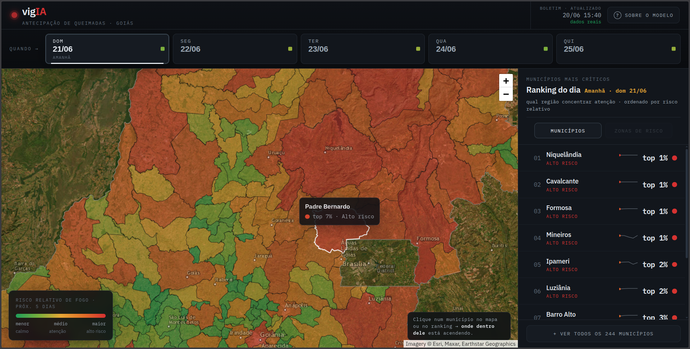

# vigIA — Previsão de Risco de Incêndio em Goiás

> Acompanhe o risco de focos de incêndio nos municípios de Goiás nos próximos 5 dias, com mapa interativo atualizado diariamente.

**Acesse:** [vigIA](https://vig-ia.vercel.app/)

---

## O que é

O vigIA é um sistema de previsão de risco de queimadas para o estado de Goiás. A cada dia, modelos de aprendizado de máquina analisam dados climáticos e históricos de focos de incêndio para estimar a probabilidade de ocorrência de fogo nos próximos 5 dias — por município e por célula espacial de ~11 km².

## Como usar

No mapa, cada município é colorido de acordo com o risco previsto:

- **Vermelho** — risco alto
- **Laranja** — risco médio  
- **Verde** — risco baixo

Use a barra de dias no topo para navegar entre os próximos 5 dias. O ranking lateral mostra os municípios em ordem decrescente de risco. Clique em qualquer município para ver o detalhamento espacial interno (células de ~11 km²).

## Atualização

O boletim é gerado automaticamente todos os dias às 03h (horário de Brasília) com base nos dados climáticos mais recentes. Nenhuma ação é necessária.

## Escopo e limitações

- Cobre 244 municípios de Goiás no bioma Cerrado
- Goiás possui 246 municípios; Gouvelândia e São Simão (bioma Mata Atlântica) estão fora do escopo do modelo e aparecem sinalizados no mapa
- As previsões são probabilísticas — indicam risco relativo, não certeza de ocorrência
- Modelos treinados com dados de 2015 a 2025 (INPE BDqueimadas + Open-Meteo)

---

*FGA0083 — Aprendizado de Máquina | UnB 2026-1 | Turma 01 | Grupo 4*  
*Felipe Rodrigues · João Paulo Cristo · Guilherme Vilela · Luiz Guilherme Faria*
