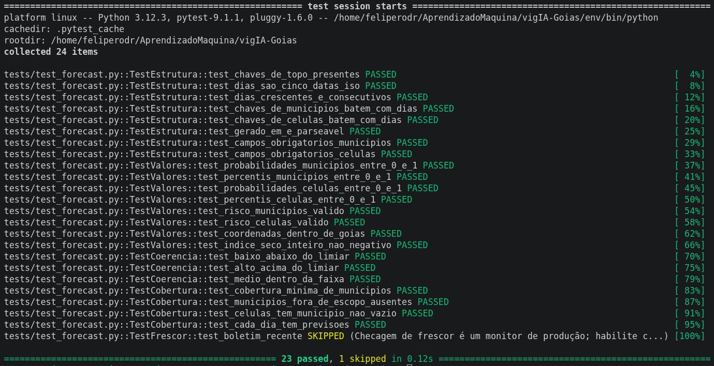

# Relatório de Prontidão para Produção — vigIA

**Projeto:** vigIA — Previsão de Risco de Incêndio em Goiás
**Disciplina:** FGA0083 — Aprendizado de Máquina · UnB 2026-1 · Turma 01 · Grupo 4
**Equipe:** Felipe Rodrigues · João Paulo Cristo · Guilherme Vilela · Luiz Guilherme Faria
**Documento:** Critério 1 — Prontidão para produção (lançamento, testes e integração)

---

## 1. Visão geral e estado atual

O vigIA estima diariamente a probabilidade de focos de incêndio nos municípios de Goiás para os próximos 5 dias, em dois níveis de granularidade: por município (E1, 244 municípios do bioma Cerrado) e por célula espacial de ~11 km² (E2, detalhamento interno). O modelo foi treinado com dados de 2015 a 2025 (INPE/BDqueimadas e Open-Meteo) e apresenta acurácia de aproximadamente 0,816.

A solução **já se encontra em produção**: a aplicação está publicada na Vercel (`vig-ia.vercel.app`) e o boletim é regenerado automaticamente todos os dias às 03h (horário de Brasília). Este relatório formaliza a estratégia de lançamento, descreve a integração com sistemas externos, documenta a suíte de testes e os controles de segurança, e define os critérios objetivos de liberação (go/no-go).

## 2. Estratégia de lançamento (deployment)

A arquitetura de produção é deliberadamente simples e de baixo custo, adequada à natureza **batch** do problema (uma previsão por dia, sem necessidade de inferência em tempo real):

- **Camada de processamento (batch):** um job agendado no GitHub Actions (`.github/workflows/previsao_diaria.yml`) executa o pipeline `previsao_leve.py` (inferência E1 + E2), gera o `forecast.json` via `exportar_json.py`, copia o arquivo para o frontend e faz commit/push automático.
- **Camada de publicação (serving):** o frontend é um site estático (HTML + Leaflet) publicado pela Vercel, que faz deploy automático a cada push no repositório. O cliente consome o `forecast.json` diretamente.
- **Agendamento:** `cron` configurado para 06h UTC (03h BRT), com disparo manual disponível (`workflow_dispatch`) para reprocessamento sob demanda.

Vantagens dessa escolha: custo operacional próximo de zero, alta disponibilidade (conteúdo estático em CDN), ausência de servidor de aplicação exposto e reprodutibilidade total do artefato diário.

```
[Open-Meteo API] [INPE BDqueimadas]
        \              /
         v            v
   GitHub Actions (cron 03h BRT)
   previsao_leve.py -> exportar_json.py -> forecast.json --commit--> repositório
                                                                        |
                                                                        v
                                                            Vercel (CDN estático)
                                                            index.html + Leaflet
                                                                        |
                                                                        v
                                       Usuários: Defesa Civil, brigadas, fiscalização, público
```

## 3. Integração com sistemas existentes

**Entradas (sistemas a montante).** O pipeline integra-se a duas fontes externas públicas:
- **Open-Meteo** — variáveis climáticas (temperatura, precipitação, vento, umidade), consumidas via API HTTP.
- **INPE / BDqueimadas** — histórico de focos de incêndio (2015–2025), base do treinamento e referência para validação.

**Saída (contrato de dados).** O `forecast.json` funciona como uma **interface estável e aberta** entre o pipeline e qualquer consumidor. Seu schema está documentado e validado por testes automatizados (ver seção 4): chaves de topo `gerado_em`, `dias`, `municipios`, `celulas`; cada registro com `prob ∈ [0,1]` e `risco ∈ {BAIXO, MÉDIO, ALTO}`. Por ser um contrato bem definido, novos sistemas podem ser integrados sem alterar o pipeline.

**Integração potencial com órgãos.** Por expor um contrato JSON público, o vigIA pode ser consumido por painéis da Defesa Civil, do Corpo de Bombeiros ou de secretarias ambientais (priorização de fiscalização e deslocamento de brigadas), seja por leitura direta do arquivo, seja por um endpoint que o reexponha. Nenhuma mudança estrutural é necessária para essa integração.

**Resiliência da integração.** O frontend implementa **degradação graciosa**: caso o `forecast.json` real esteja ausente ou inválido, ele recorre a uma previsão sintética de contingência, garantindo que o usuário nunca veja uma tela vazia. Esse é o principal mecanismo de tolerância a falhas das fontes externas.

## 4. Testes de estabilidade e validação

A solução conta com uma suíte de testes automatizados (`tests/test_forecast.py`, em `pytest`) que valida o artefato gerado antes da publicação. Os testes foram desenhados para o schema real do `forecast.json` e cobrem:

| Grupo | O que verifica |
|---|---|
| Estrutura | Chaves de topo, 5 dias ISO consecutivos, correspondência entre `dias` e as chaves de `municipios`/`celulas`, campos obrigatórios, `gerado_em` parseável |
| Valores | `prob ∈ [0,1]`, `risco ∈ {BAIXO, MÉDIO, ALTO}`, coordenadas dentro de Goiás, índice de dias secos inteiro não negativo |
| Coerência | Separação das classes de risco por faixa de **percentil** (limiares 0,70 e 0,90); detecção de inversões (ex.: "ALTO" com percentil baixo) |
| Cobertura/escopo | ~244 municípios previstos; ausência de municípios fora de escopo (Gouvelândia, São Simão) |
| Frescor | Boletim com no máximo N horas (monitor de produção, desabilitado por padrão para não falhar em avaliações offline) |

A suíte foi verificada contra um boletim válido (todos os testes de correção passam) e contra dez mutações propositais de dados, todas detectadas pelo teste correspondente. Os testes não dependem de rede e usam apenas a biblioteca padrão.

**Gate de qualidade no CI/CD.** Recomenda-se inserir a execução de `pytest` no workflow do GitHub Actions **antes** do commit do `forecast.json`. Com isso, um boletim malformado é barrado automaticamente e não chega à produção, transformando o pipeline em um CI/CD com portão de qualidade efetivo.

## 5. Segurança

- **Segredos e credenciais.** O pipeline não utiliza chaves privadas — Open-Meteo e INPE são fontes públicas. O `GITHUB_TOKEN` do workflow opera com permissão mínima (`contents: write`), suficiente apenas para o commit do boletim.
- **Privacidade / LGPD.** O sistema processa exclusivamente dados ambientais e geográficos públicos; **nenhum dado pessoal** é coletado, armazenado ou processado, o que reduz a quase nulo o risco de privacidade.
- **Superfície de ataque.** O serving é estático (sem backend de aplicação exposto), eliminando vetores típicos de injeção e comprometimento de servidor. As dependências são fixadas em `requirements.txt`, reduzindo risco de cadeia de suprimentos.
- **Disponibilidade.** A dependência de APIs externas (sobretudo Open-Meteo) é o principal ponto único de falha. Mitigações: fallback do frontend, alertas de frescor no monitoramento e reprocessamento manual via `workflow_dispatch`.

## 6. Critérios de liberação (Go / No-Go)

A publicação de um novo boletim só é considerada apta quando **todos** os itens abaixo estão verdes:

- [ ] Pipeline (`previsao_leve.py` + `exportar_json.py`) executa sem erro.
- [ ] Suíte `pytest` passa integralmente (schema, valores, coerência, cobertura).
- [ ] `forecast.json` contém os 5 dias e cobertura ≥ 98% dos municípios em escopo.
- [ ] Nenhuma probabilidade fora de [0,1] e nenhum rótulo de risco inválido.
- [ ] Frontend carrega o boletim real (sem cair no fallback sintético).
- [ ] Deploy da Vercel concluído com sucesso.

Em caso de **No-Go**, mantém-se o último boletim válido publicado e aciona-se o runbook de manutenção (documento de Estratégia de Manutenção, seção de runbook).

## 7. Riscos de lançamento e plano de rollback inicial

| Risco | Probabilidade | Impacto | Mitigação |
|---|---|---|---|
| Open-Meteo indisponível | Média | Boletim não atualiza | Fallback do frontend + reprocessamento manual; manter último boletim válido |
| Schema do JSON quebrado por mudança no código | Baixa | Frontend não renderiza | Gate `pytest` no CI bloqueia o commit |
| Deploy da Vercel falha | Baixa | App fora do ar | Rollback para deploy anterior na própria Vercel |
| Degradação silenciosa do modelo | Média | Previsões piores sem aviso | Backtest e monitoramento contínuo (Critério 2) |

O rollback de emergência consiste em reverter o commit do `forecast.json` (volta ao boletim anterior) e/ou reverter o deploy na Vercel, ambos operações imediatas.

## 8. Evidências de execução

### 8.1 Saída da suíte de testes (offline)

Executado com `python -m pytest tests/ -v` contra o `forecast.json` mais recente:



> **Como reproduzir:** com o repositório clonado e um `forecast.json` válido em `frontend/` ou `pbl/`:
> ```bash
> pip install pytest
> python -m pytest tests/ -v
> ```

### 8.2 Teste de frescor do boletim (produção)

O `TestFrescor.test_boletim_recente` verifica se o boletim tem menos de N horas e está **desabilitado por padrão** para não falhar em avaliações offline. Ele só faz sentido em ambiente de produção, onde o `forecast.json` é atualizado diariamente.

**Para ver o resultado em produção:**

1. Acesse o repositório no GitHub → aba **Actions**
2. Selecione o workflow **"Testes Agendados + Monitoramento vigIA"** (`tests_scheduled.yml`)
3. Clique na execução mais recente e abra o step **"Rodar testes (com checagem de frescor habilitada)"**

A saída mostrará o teste `test_boletim_recente` como `PASSED` (boletim recente) ou `FAILED` com a mensagem de quantas horas o boletim tem.

**Para acionar manualmente:**

Na aba Actions, selecione o workflow e clique em **"Run workflow"** (botão `workflow_dispatch`). O teste rodará com `VIGIA_CHECK_FRESHNESS=1` e o resultado aparece nos logs em ~2 minutos.

**Localmente** (se tiver um `forecast.json` recente):
```bash
VIGIA_CHECK_FRESHNESS=1 python -m pytest tests/ -v
VIGIA_CHECK_FRESHNESS=1 VIGIA_MAX_IDADE_H=24 python -m pytest tests/ -v
```

### 8.3 Sistema em produção


> Acesse [vig-ia.vercel.app](https://vig-ia.vercel.app/) para ver o estado atual.

## 9. Conclusão

O vigIA está operando em produção com uma arquitetura adequada ao seu perfil de uso, integração estável com fontes externas por meio de um contrato de dados aberto, suíte de testes automatizados verificada e controles de segurança proporcionais ao baixo risco da aplicação. As lacunas remanescentes — formalização do gate de testes no CI e do monitoramento contínuo — estão endereçadas, respectivamente, na recomendação da seção 4 e nos documentos de Plano de Monitoramento e Estratégia de Manutenção.